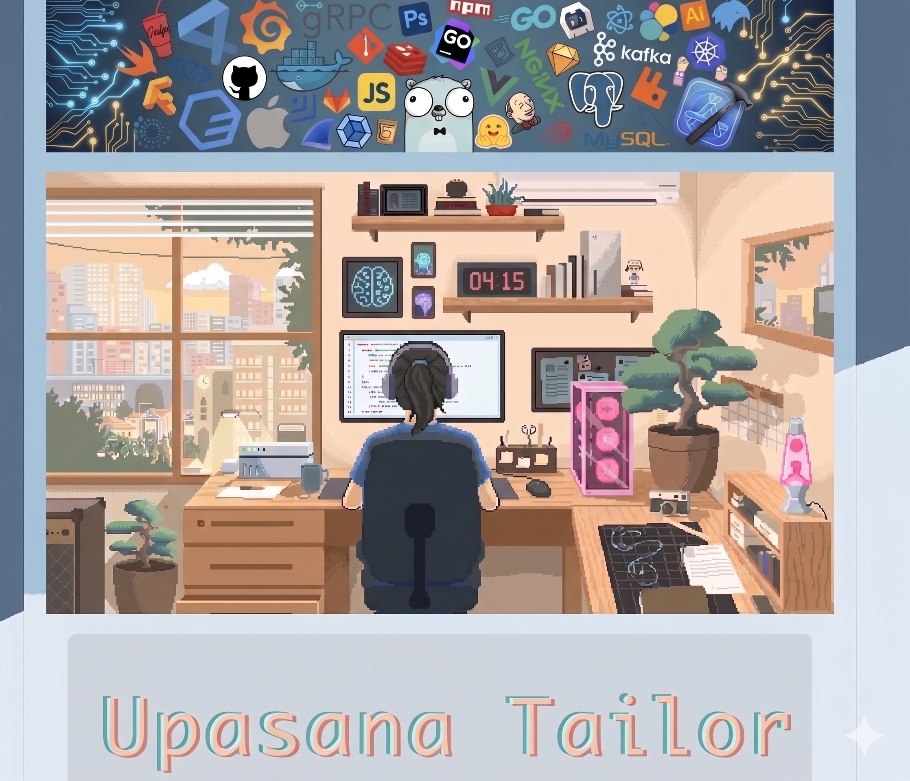

# Hi there 👋 I'm Upasana Tailor

# Upasana Tailor | Frontend & Full-Stack Engineer

> **Cloud-Native Developer & Technical Instructor specializing in Scalable Web Architectures & AI Frameworks.**

📍 Landsberg am Lech, Germany  
 ✉️ upasanatailor90@gmail.com | 🌐 [GitHub](https://github.com/upasanatailor) | 💼 [LinkedIn](https://www.linkedin.com/in/upasana-tailor-b24539152) 

---

## 🚀 About Me
I am a dedicated Full-Stack Engineer and Technical Instructor with a deep background in designing, building, and deploying modern web applications and cloud solutions. Having mentored over 100+ developers and built production-ready systems, I thrive on creating clean, maintainable code, optimizing cloud-native workflows, and implementing intelligent AI automation.

- 🛠️ **Current Focus:** Building agentic AI workflows and integrating scalable cloud observability practices.
- 🗣️ **Languages:** English (C1), German (B2 Telc Certified), Hindi (Native).

---

## 🧰 Technical Stack

| Category | Technologies |
| :--- | :--- |
| **Frontend** | React.js, Redux, TypeScript, Next.js, Material UI, Tailwind CSS, Styled Components |
| **Backend & APIs** | Node.js, Express.js, Python, RESTful API Design & Integration |
| **AI Frameworks** | LangChain, LangGraph, Retrieval-Augmented Generation (RAG), Amazon Bedrock |
| **DevOps & Cloud** | AWS Fundamentals, Kubernetes (K8s), Docker, Terraform, Vercel, Linux, CI/CD, Git |
| **Databases** | PostgreSQL, MongoDB, MySQL |

---

## 📂 Key Projects & Repositories

### 1. Agentic AI & Generative Workflows (LangChain / LangGraph)
*An exploratory and production-focused suite of implementations involving LLM orchestration, vector databases, and multi-agent system state management.*
* **Technologies:** Python, LangChain, LangGraph, RAG, OpenAI API, Vector DBs.
- 🔗 *[ AI / LLM Repository](https://github.com/upasanatailor/bedrock-langgraph-rag)]* – Brief summary of what it does (e.g., *Built a multi-agent workflow that processes unstructured documentation into a queryable RAG vector database.*)

### 2. Scalable Cloud-Native Full-Stack Application
*A modern multi-tier web application built to showcase orchestration and cloud deployment principles.*
* **Technologies:** TypeScript, React.js, Node.js, Docker, Kubernetes, PostgreSQL.
- 🔗 *[[cloud terraform Repo](https://github.com/upasanatailor/AWS_Terraform_Projects)]* – Brief summary (e.g., *Containerized full-stack architecture running inside a local Kubernetes cluster, deploying automated CI/CD configurations.*)

### 3. REST API & Backend Service Architecture
*High-performance backend API service emphasizing robust security, proper error tracking, and predictable state management.*
* **Technologies:** Node.js, Express.js, MongoDB/PostgreSQL, Jest (Testing), Postman.
- 🔗 *[[ API Repo](https://github.com/upasanatailor/BlindSide_Project)]* – Brief summary (e.g., *Designed a relational DB-backed RESTful service incorporating data protection parameters and automated route validation testing.*)

---

## 📈 Professional Journey

#### **Full-Stack Web Development Trainer** | Digital Career Institute (DCI), Germany *(2022 — 2026)*
* Guided 100+ international professionals into engineering careers covering React.js, Node.js, and advanced cloud-native practices.
* Implemented continuous code reviews, architectural validations, and technical mock interviews mimicking real-world production demands.

#### **Full Stack Developer** | CDAC India *(Centre for Development of Advanced Computing)*
* Designed, maintained, and optimized responsive enterprise-scale web systems utilizing React.js, custom REST API layers, and highly reliable state components.

---

## 📜 Certifications & Education
* **Bachelor in Electronics and Communication** – Rajasthan Technical University
* **Train the Trainer Certificate** – Adult Educational Pedagogy Certification
* **IBM Data Science Certificate** – Coursera
* **B2 Telc Certified** – German Language Proficiency

---
💡 *Feel free to explore my repositories or reach out for collaborations regarding Cloud-Native Architectures, Full-Stack applications, or AI Engineering!*
